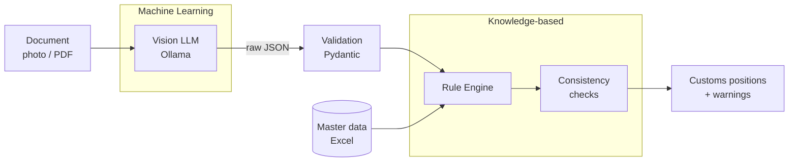
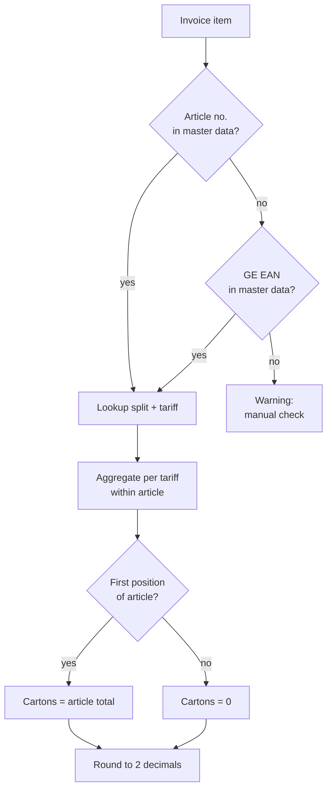

# telos

Hybrid ML + rule-based extraction of customs data from trade documents.

A local vision LLM **reads** invoices, packing lists and shipment notices.
A deterministic rule engine **decides**: it turns the extracted data into
customs positions (tariff lookup, splitting, aggregation, rounding, checks).

> Semester project – *Machine Learning and Knowledge-Based Systems*,
> BSc Business AI, FHNW. Authors: Noah Rolli, <Name>

## Why hybrid?

| Layer | Approach | Responsibility |
|---|---|---|
| Extraction | Local vision LLM (Ollama) | What is written on the document? |
| Validation | Pydantic schemas | Is the extracted data well-formed? |
| Rules | Knowledge-based rule engine | What does it mean for customs? |
| Checks | Cross-document consistency | Do totals, weights and counts match? |

The model never decides a tariff number. Every customs position can be
traced back to an explicit rule – which keeps results explainable and auditable.

## Pipeline



## Rules



| Rule | Description |
|---|---|
| Lookup | Article number first, GE EAN (GTIN) as fallback |
| Split | Master data defines whether an article is split into sub-positions |
| Aggregation | Sub-positions with the same tariff are merged – only within one article |
| Cartons | First position of an article (invoice order) gets the article total, others 0 |
| Rounding | Aggregate first, then round to 2 decimals; ±0.01 deviation from invoice total is accepted |

## Project structure

```
src/telos/
├── extraction/   ML: document → structured data
└── rules/        knowledge base: customs rules
data/
├── private/      real documents – never committed
└── samples/      anonymised / synthetic test documents
tests/
docs/
```

## Setup

```bash
python3 -m venv .venv
source .venv/bin/activate
pip install -r requirements.txt
```

Requires a local [Ollama](https://ollama.com) installation for extraction.

## Data privacy

All processing runs locally – no document leaves the machine.
Real trade documents and master data are excluded via `.gitignore`;
the repository only contains anonymised or synthetic samples.

## Status

- [x] Project structure
- [ ] Data model
- [ ] Extraction prototype
- [ ] Rule engine
- [ ] Evaluation
